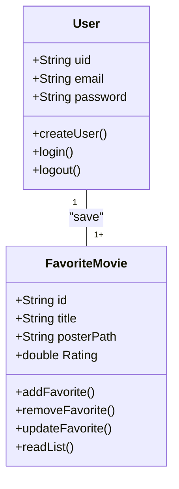
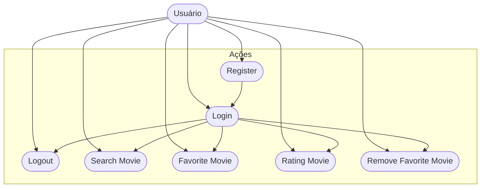

# CineFavorite - Formativa
Construir um Aplicativo do Zero - O CineFavorite permitirá criar uma conta e buscar filmes em uma API e montar uma galeria pessoal de filmes favoritos, com posters e notas

## Objetivos
- Criar uma Galeria Personalizada por Usuário de Filmes Favoritos 
- Conecar o APP com uma API( base de Dados) de Filmes
- Permitir a Criação de Contar para Cada Usuário
- Listar Filmes por Palavra-Chave


## levantamento de Requistos do Projeto
- ### Funcionais 

- ### não Funcionais

## Recursos do Projeto
- Flutter /Dart
- FireBase ( Authentication / FireStore DataBase)
- API TMDB
- Figma
- VsCode

## Diagramas

1. ### Classes
    Demonstrar o Funcionamento das Entidades do Sistema
    - Usuario (User) : classe já modela pelo FirebaseAuth
        - email
        - password
        - uid
        - login()
        - create()
        - logout()

    - FilmeFavorito: Classe modelada pelo DEV
        - number:id
        - String: Título
        - String: Poster
        - double: Rating
        - adicionar()
        - remover()
        - listar()
        - updateNota()


2. ### Uso
    Ações que os Atores podem FAzer
    - User:
        - Registrar
        - Login
        - logout
        - Procurar Filmes API
        - SAlvar Filmes Favoritos
        - Dar Nota aos Filmes
        - Remover dos Favoritos 


3. ### Fluxo
    Determina o Caminho percorrido pelo aTor para executar uma ação

    - Ação de Login

```mermaid

graph TD

    A[Ínicio] --> B {Login Usuário}
    B --> C[Inserir Email e Senha] 
    C --> D{Validar as Credenciais}
    D --> E[Sim]
    E --> F[Tela de Favoritos]
    D --> G[Não]
    G --> B

```

## Prototipagem

https://www.figma.com/design/ruHQqTKum308aIIx3grniS/Untitled?node-id=1-24&t=7Y0gYPX5umXNwrhj-1

## Codificação


### IMPORTANTE
o que ele faz - requisitos funcionais 
como ele vai fazer - requisitos não# CineFavorite - Formativa
Construir um Aplicativo do Zero - O CineFavorite permitirá criar uma conta e buscar filmes em uma API e montar uma galeria pessoal de filmes favoritos, com posters e notas

## Objetivos
- Criar uma Galeria Personalizada por Usuário de Filmes Favoritos 
- Conectar o APP com uma API (base de Dados) de Filmes
- Permitir a Criação de Conta para Cada Usuário
- Listar Filmes por Palavra-Chave

## Levantamento de Requisitos do Projeto
- ### Funcionais 

- ### Não Funcionais

## Recursos do Projeto
- Flutter / Dart
- Firebase (Authentication / Firestore Database)
- API TMDB
- Figma
- VSCode

## Diagramas

1. ### Classes
    Demonstrar o Funcionamento das Entidades do Sistema
    - Usuário (User): classe já modelada pelo FirebaseAuth
        - email
        - password
        - uid
        - login()
        - create()
        - logout()

    - FilmeFavorito: Classe modelada pelo DEV
        - number: id
        - String: Título
        - String: Poster
        - double: Rating
        - adicionar()
        - remover()
        - listar()
        - updateNota()


2. ### Uso
    Ações que os Atores podem Fazer
    - User:
        - Registrar
        - Login
        - Logout
        - Procurar Filmes na API
        - Salvar Filmes Favoritos
        - Dar Nota aos Filmes
        - Remover dos Favoritos 


3. ### Fluxo
    Determina o Caminho percorrido pelo ator para executar uma ação

    - Ação de Login

```mermaid

graph TD

    A[Início] --> B {Login Usuário}
    B --> C[Inserir Email e Senha] 
    C --> D{Validar as Credenciais}
    D --> E[Sim]
    E --> F[Tela de Favoritos]
    D --> G[Não]
    G --> B

```

## Prototipagem

https://www.figma.com/design/ruHQqTKum308aIIx3grniS/Untitled?node-id=1-24&t=7Y0gYPX5umXNwrhj-1

## Codificação

### IMPORTANTE
O que ele faz - requisitos funcionais  
Como ele vai fazer - requisitos não funcionais 

## Diagrama de Classe 

- Representa aquilo que eu vou armazenar.
- É modelar as informações que eu vou salvar.
- Ele determina o funcionamento do projeto, através dele tem os atores que fazem as ações, que criam os fluxos.

- Entidade - informação de um objeto que eu salvo, armazeno; Representa o que do meu app (informações) vai ser salvo no meu banco de dados.

- Modelo de Classe - serve pra modelar os dados que eu vou armazenar, do jeito que eu quero e preciso.

## Diagrama de Uso
- Quais as ações dos atores (ex: usuário)
- Mesmo dentro de uma classe podemos ter vários atores!!

## Diagrama de Fluxo
- Determina o caminho para o ator executar a ação. funcionais 

## Diagrama de Classe 

-- Representa aquilo que eu vou armazenar.
-- é modelar as informações que eu vou salvar.
-- ele determina o funcionamento do projeto, através dele tem os atores que fazem as ações, que criam os fluxos.

-- Entidade - informação de um objeto que eu salvo, armazeno; Representa oq do meu app  (informações) vai ser salvo no meu banco de dados.

-- Modelo de Classe - serve pra modelar os dados que eu vou armazenar, do jeito que eu quero e preciso.


## Diagrama de Uso
-- quais as ações dos atores (ex: usuário)
-- mesmo dentro de uma classe podemos ter város atores!!

## Diagrama de Fluxo
-- determina o caminho para o ator execular a ação.

